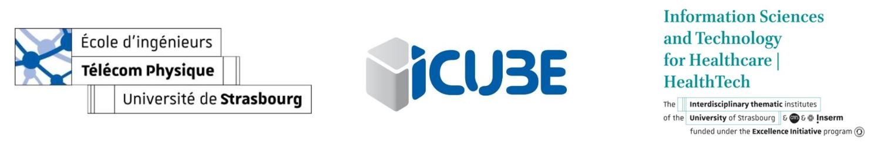
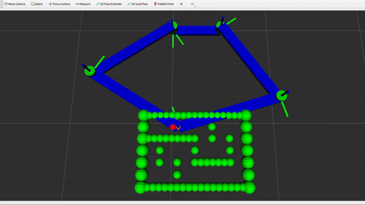

<!-- Improved compatibility of back to top link: See: https://github.com/othneildrew/Best-README-Template/pull/73 -->

[![LinkedIn][linkedin-shield]][linkedin-url]

<!-- PROJECT LOGO -->
 

  

  <h1 align="center">Design and Simulation of a Virtual Environment and Collision Model for the Haptic Device Pantograph</h1>

  

    <a href="https://github.com/Jesse-Alves?tab=repositories"><strong>View all repositories  »</strong></a>
     
     
  

<!-- TABLE OF CONTENTS -->

  
Table of Contents

  <ol>
    <li>
      <a href="#about-the-project">About The Project</a>
      <ul>
        <li><a href="#built-with">Built With</a></li>
      </ul>
    </li>
    <li>
      <a href="#getting-started">Getting Started</a>
      <ul>
        <li><a href="#prerequisites">Prerequisites</a></li>
<!--         <li><a href="#installation">Installation</a></li> -->
      </ul>
    </li>
    <li><a href="#usage">Usage</a></li>
<!--     <li><a href="#roadmap">Roadmap</a></li>
    <li><a href="#contributing">Contributing</a></li>
    <li><a href="#license">License</a></li> -->
    <li><a href="#contact">Contact</a></li>
<!--     <li><a href="#acknowledgments">Acknowledgments</a></li> -->
  </ol>

<!-- ABOUT THE PROJECT -->
## About The Project

Currently, robotics-assisted devices, such as exoskeleton and collaborative robotic arms, have been used for rehabilitation therapy. Where one of the biggest causes of the physical disability is stroke. However, despite the high benefits and potential of using these devices, the clinical application remains limited due mainly to the complexity and the high cost. Therefore, different strategies are used to overcome these limitations, such as the use of alternatives sensors and materials. In this context, this article presents the prototyping of a low cost and compact bracelet to detect the upper arm contraction using Force Sensing Resistor (FSR) and then, send the data from a cheap microcontroller to Robot Operating System (ROS2) environment.

Keywords: Rehabilitation, Post-Stroke, Robotic, FSR, Low-Cost.

[(Project Presentation)]()

## Collision Model Simulation

    

[(Full Videos)]()

### Robo Model in RVIZ

  

  

(<a href="#readme-top">back to top</a>)

### Built With
*  
*  
* 
* 
* 

(<a href="#readme-top">back to top</a>)

<!-- GETTING STARTED -->
## Getting Started

The Haptic loop is a collision model developed to be used in Haptic Device. It was developed in ROS2 Humble. 

### The Project files

* The haptic_description 

This package describe the Pantograph robot in URDF file, following the dimentions used for High Cost group and the base frame from article: "The Pantograph Mk-II: A Haptic Instrument, Gianni Campion, Student Member, IEEE, Qi Wang, Member, IEEE, and Vincent Hayward, Senior Member, IEEE"
 
  
* The haptic_bringup

This package lauch all the packages in ROS2. 
 
* The haptic_nodes

In this packages, inside of Scripts folder will be find:
 
   I - "pseudo_trajectory.py" - A publisher to simulate the movement of the robot from the user. This node publish 
   	the angles theta1 and theta5, in order to simulate what really happend with the encoders sensors read by 
   	a microcontroller.
   	
   II - "markers.py" - A node to publish markers message to show the maze spheres in RVIZ.
   
   III - "create_random_maze.py" 
   	- It is a simple python code that generate a random maze in collision model. 
   	- It is possible change this maze changing the variables: "w" - width, "h" - height, 
   	  "workspace" - the cordinates of the robot workspace corner.
   	- Also, it is possible, increase or decrease the number of sphere, by changing the factor that multiply the radius in the 
   	  loops (convert_maze function).
   	- This file generate a csv file.
   	  
   IV - "haptic_loop.py" This is the haptic loop itself. It is a node that read the encoder angles topics, import a csv file with the 
   	spheres information (radius, center x, center y), compute the distance between the robot end-effector and the spheres, in case of
   	collision, compute the force of the collision (based on spring damper model), compute the motors torque necessary to produce this force and publish this torque via topic.
 
 
* Simulations in ROS bag
 
 - Some important simulations were recorded using ROS bag, i.e., the topics in the simulation. It is possible to run this simulation using Plot Juggler.

### Prerequisites

All this project was built in ROS2 Humble environment, using ROS2 Control.

<!-- USAGE EXAMPLES -->
## Usage

1 - Unzip the file in ubuntu system.
2 - Open the terminal in ubuntu inside of /src directory.
3 - Run the code below to test.

`colcon build --cmake-args -DCMAKE_BUILD_TYPE=Release --symlink-install && source install/setup.bash && ros2 launch haptic_bringup haptic.launch.py`

(<a href="#readme-top">back to top</a>)

<!-- CONTACT -->
## Contact

Jessé de Oliveira Santana Alves - [Linkedin - jessealves11](https://linkedin.com/in/jessealves11) - jessalves2@gmail.com

(<a href="#readme-top">back to top</a>)

<!-- MARKDOWN LINKS & IMAGES -->
[linkedin-shield]: https://img.shields.io/badge/-LinkedIn-black.svg?style=for-the-badge&logo=linkedin&colorB=555
[linkedin-url]: https://linkedin.com/in/jessealves11
